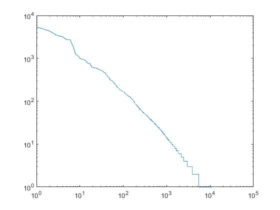

# 中文小说词频统计及正则匹配

### 首先导入中文分词库jieba，Counter库和re库
```
import jieba
import re
from collections import Counter
```

### 导入打开要处理的文本傲慢与偏见中文版小说并利用jieba分词
```
txt = open("傲慢与偏见.txt", "r", encoding="gb18030").read()
words = jieba.lcut(txt)
```

### 去除的标点符号,只统计词频
```
excludes = {"，", "。", "\n", "-", "“", "”", "：", "；", "？", "（", "）", "！", "…"}
```

### 遍历计数并去除标点
```
for word in words:
    counts[word] = counts.get(word,0)+1
    
for word in excludes:
    del counts[word]
```

### 返回遍历得分所有键与值并排序
```
items = list(counts.items())
items.sort(key=lambda x: x[1], reverse=True)
```

### 将统计数据写入txt文本
```
file = open('data.txt', mode='w')

for i in range(10963):
    word, count = items[i]
    print("{0:<10}{1:>5}".format(word,count))
    
    new_context = word + "   " + str(count) + '\n'
    file.write(new_context)

file.close()
```

### 正则匹配结果
```
result = open('正则.txt', mode='w')
#存正则匹配的数组
things = []

#正则匹配：人物说的内容
for i in re.finditer("[说｜道]：“(.+)\？”", txt):
    message = i.group(1)
    things.append(message)

#计数和展示
c = Counter(things)
for k, v in c.most_common(51):
    print(k, v)
    context = k + "   " + str(v) + '\n'
    result.write(context)

result.close()
```

### 输出 data.txt是词频统计的文本数据，正则是匹配人物说的话并且是问句，结果写入 正则.txt

### 验证Zipf-Law


